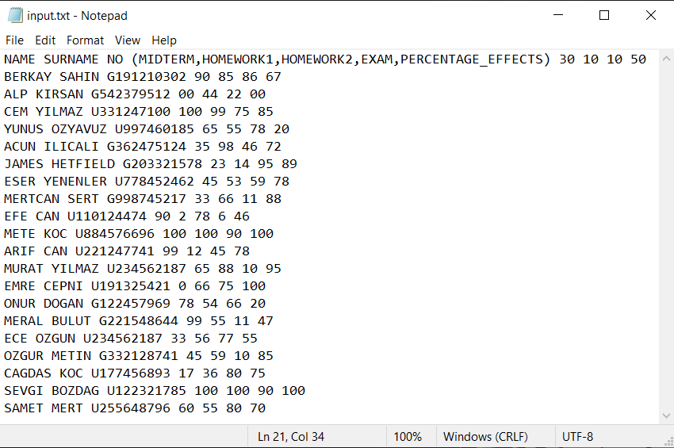
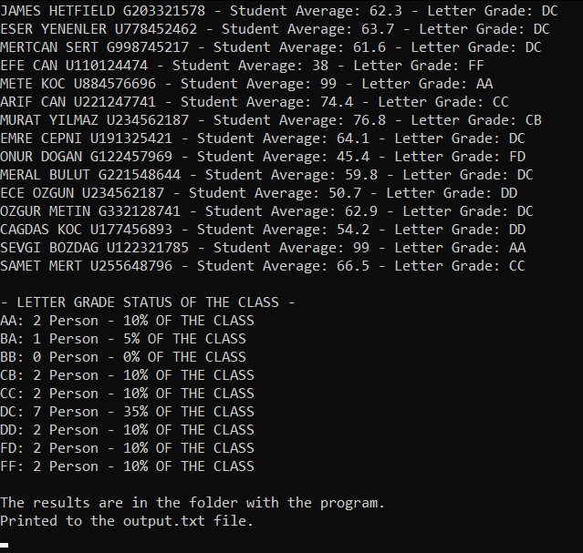
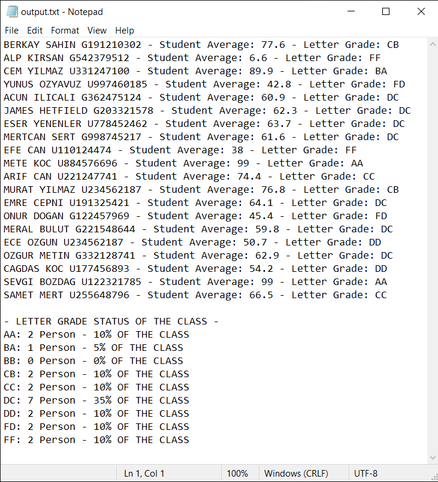
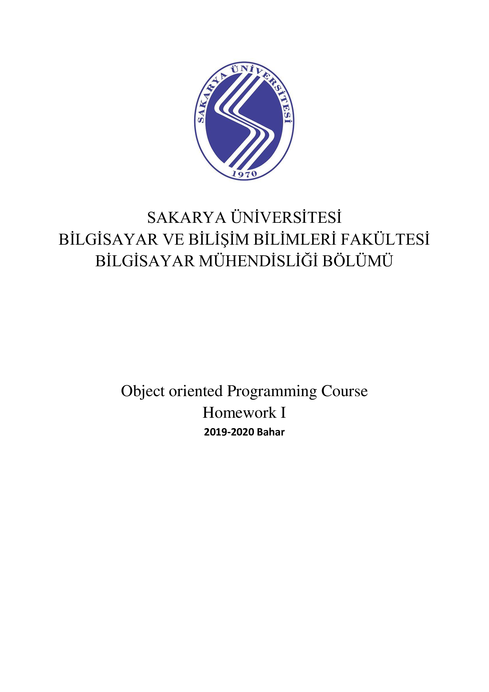
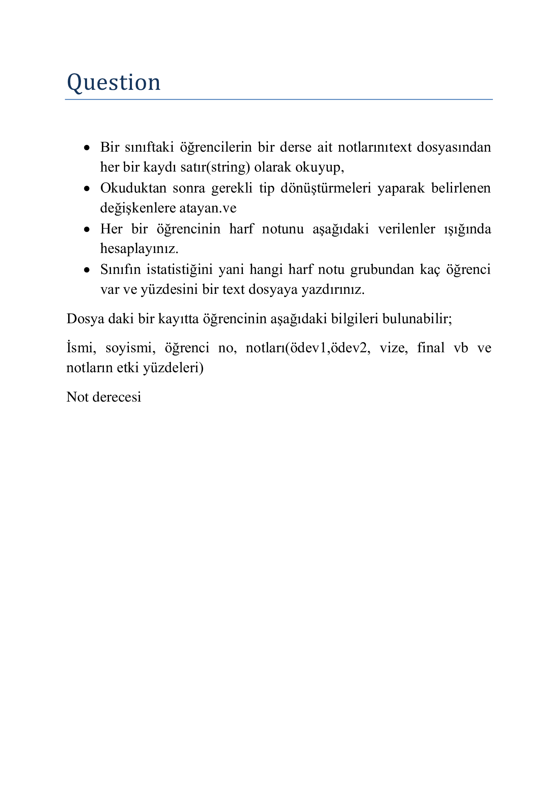
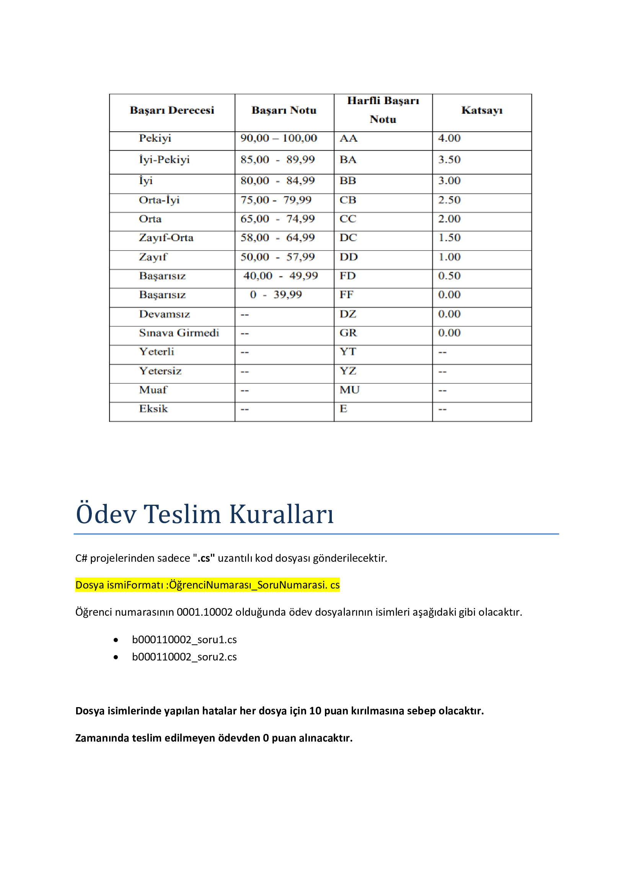
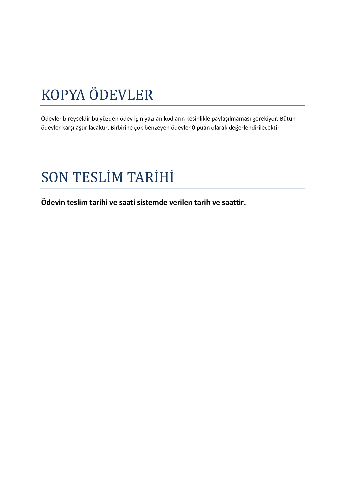
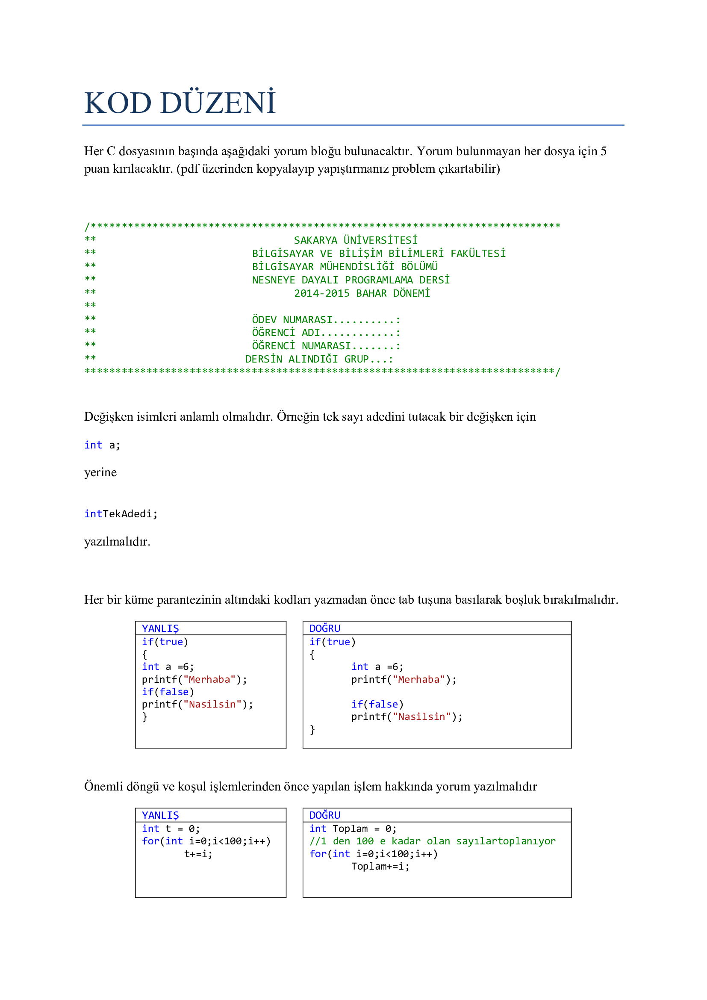

# 2019
# Collage Grading App - Object Oriented Programming Project

  At assignment, to make a system to calculate the grades and letter grades of students in a 
  university course and write a report as a text file.

### Used Technologies
  
  - C#
   
## Screenshots

## Homework Document

Sakarya University - Computer Engineering - Object Oriented Programming Course Homework

  - Berkay Şahin - https://github.com/berkaysahin - https://www.linkedin.com/in/berkaysahin3/ - iletisim@berkaysahin.info

